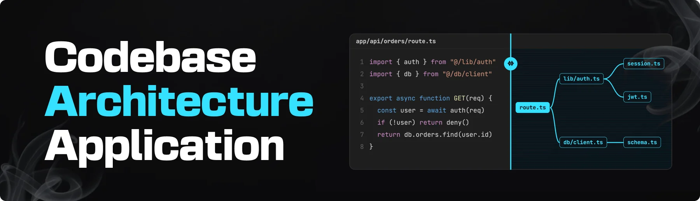

# Cartograph | AI-Powered Codebase Dependency Mapper



[](https://github.com/kumaraswini-11/cartograph/actions/workflows/ci.yml)
[](LICENSE)
[](https://nodejs.org)

[](https://nextjs.org)
[](https://react.dev)
[](https://www.typescriptlang.org)
[](https://tailwindcss.com)
[](https://reactflow.dev)
[](https://github.com/dagrejs/dagre)
[](https://clerk.com)
[](https://supabase.com)
[](https://www.langchain.com/langsmith)
[](https://www.coderabbit.ai)

> A **cartograph** is a map or chart. The word comes from Greek _chartēs_ (paper, map) and _graphein_ (to draw or write). **Cartography** is the craft of making maps; a **cartographer** is the person who makes them.
>
> A cartographer surveys unknown ground and turns it into a map people can trust. Cartograph does that for a codebase you didn't write.

A dependency map of any public TypeScript or JavaScript repository, drawn from the code itself.

## About

Teams now ship code nobody on the team has read. An agent wrote it, someone confirmed it worked, it shipped. Over time that builds structure nobody chose: imports routed through layers of re-exports, a utility forty files depend on, modules nothing references. The questions that follow are structural (what is this file, what depends on it, what breaks if it changes), and answering them by reading imports one file at a time stops working past a few dozen files.

Cartograph answers them with a map. Every box and every line comes from really parsing the code. The AI may explain and label what the parser found; it never decides that two files are connected.

## Features (planned)

- **Real parsing**: imports, re-exports, dynamic imports and `require()` become edges. An import that can't be resolved is reported with a reason, never guessed.
- **Coverage report**: how much of the repository was parsed, and why the rest wasn't.
- **Interactive map**: folders fold into boxes and expand into files; select a file to highlight what flows into and out of it.
- **Blast radius and dependency chains**: arithmetic over the edge list, shown instantly with no network request.
- **Grounded explanations**: a paragraph about a file, written from the file and its real neighbours, cached, and checked never to name a file that doesn't exist.
- **Repository chat**: an agent that looks facts up and shows its lookups before it answers. Graph walks are done by the same arithmetic that draws the map, never by the model.
- **Organizations**: analyses belong to an organization; access is enforced by Postgres row-level security, not by application code.
- **Live progress** while a repository is being parsed.

## Status

Early development, built phase by phase from specs in `docs/specs/`. Nothing above is built yet.

## Requirements

- Node.js **24.x** (LTS), see `.nvmrc`
- pnpm **10.34.6**, pinned in `package.json` (pnpm ≥ 10 switches to it automatically)

## Getting started

```bash
pnpm install
cp .env.example .env.local   # then fill in values
pnpm dev
```

Open <http://localhost:3000>.

## Scripts

| Command                                   | What it does                                                                                                       |
| ----------------------------------------- | ------------------------------------------------------------------------------------------------------------------ |
| `pnpm dev`                                | Dev server                                                                                                         |
| `pnpm build`                              | Production build                                                                                                   |
| `pnpm start`                              | Serve the production build                                                                                         |
| `pnpm format` / `pnpm format:check`       | Prettier: format (incl. import and Tailwind class order) / check                                                   |
| `pnpm lint` / `pnpm lint:fix`             | ESLint / auto-fix                                                                                                  |
| `pnpm typecheck`                          | Generate route types, then `tsc --noEmit`                                                                          |
| `pnpm skills:list` / `pnpm skills:update` | List the vendored agent skills / update them from upstream (then verify and commit; see `docs/stack-decisions.md`) |

CI runs format check, lint, typecheck and build on every pull request.

## Docs

- [Project doc](docs/project-doc.md): what Cartograph is and why each decision was made
- [CLAUDE.md](CLAUDE.md): working rules for building it
- [Stack decisions](docs/stack-decisions.md): toolchain versions, sources and upgrade plan. Read before upgrading anything.
- [Bookmarks](docs/bookmarks.md): useful external references

## License

Proprietary. Copyright (c) 2026 Aswini Kumar. All rights reserved. See [LICENSE](LICENSE).
